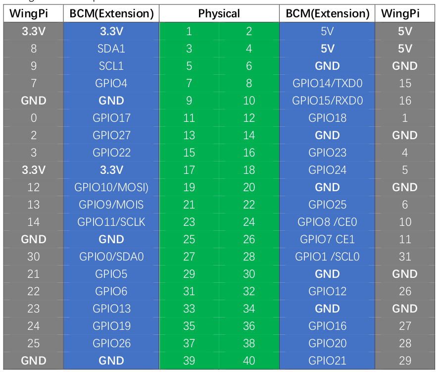
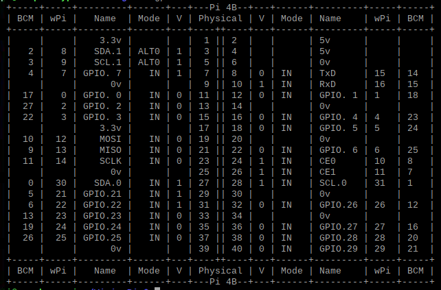

# GPIO Basics

GPIO refers to the pin-outs on a Raspberry Pi. I'm using RPI 4 primarily for all of my work.

## GPIO Numbering modes

GPIOs can be referenced either by **physical numbering** which starts in the top-left and reads across and down from 1-40, or with **BCM numbering** which uses the Broadcom processing chip references for the GPIO numbers.

## Working with GPIO

There are two methods to use the relevant commands required to configure the GPIO on the Raspberry Pi.

### **WiringPi**

WiringPi is a C library which needs to be built on the Pi to work with the GPIO. This is installed via its GitHub repo and only requires a couple of simple commands.

    git clone https://github.com/WiringPi/WiringPi
    cd WiringPi
    ./build

### **RPi.GPIO**

RPi.GPIO is a Python library and is therefore installed via Python with the PyPi repository. This is a more straightforward option to install and doesn't require the library to be built.

    python -m pip install RPi-GPIO

### Verifying the install

    gpio -v (verifies install)

Once installed, you can use the following command to show all of the pins, the respective numbering and their current modes:

    gpio readall

## Setting GPIO numbering mode

GPIO is used to set the relevant mode for GPIO numbering.

### Physical GPIO numbering

    gpio.setmode (GPIO.BOARD)

### BCM Numbering

    gpio.setmode (GPIO.BCM)

## Working with GPIO Pins
