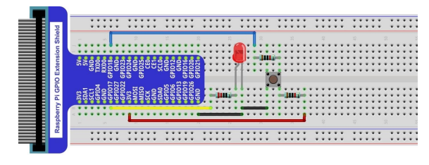
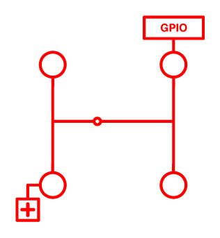
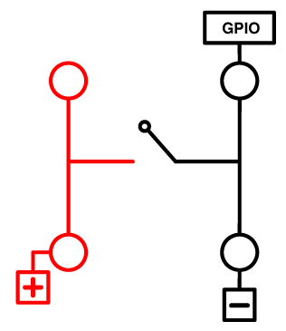
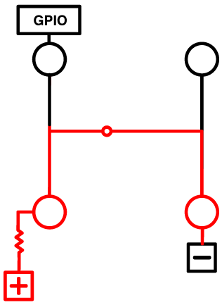

# How pull-down and pull-up resistors work

Credit for this article from [here](https://www.freecodecamp.org/news/a-simple-explanation-of-pull-down-and-pull-up-resistors-660b308f116a/) by **Taron Foxworth**.

I've recreated it here in case the original article is pulled in the future. I think it's an awesome article so didn't want to lose it!

My reason to seek out this article was due to a confusing experiment I ran through from my Freenove RaspberryPi Kit. Whilst it worked I didn't know why, and it talked about pulling-up and pulling-down but without an explanation.

The linked article helped me to understand! I've re-used most of it below, but made it relevant to my specific experience rather than the Audino reference in the original article

---

## Raspberry Pi and Pull-Down resistors

The second experiment in my Freenove kit was to wire up the following with a number of resistors and cables to demonstrate a basic switched circuit.

When the button is pressed the LED lights up. I wired it, entered the code and ran it and it worked. Cool, huh? Well, not entirely as I couldn't make head nor tail of the wiring diagram and *why* it worked.

I'll get into the detail of how and why it worked, but firstly some basic concepts.

### **The basics and PULL-UP circuits**

*All of the diagrams I use here are from the excellent article and I re-use them gratefully*

So, the wiring diagram on the breadboard was showing a circuit with an LED to light up.

As per this diagram above, this is the simplistic view of what's being achieved. The circuit isn't connected until we press the button, then the magic happens and the LED lights up.

In the background, and to make the code work properly, we want the Pi to read a **0** when the siwtch is closed and a **1** when it's open. This allows us to code the logic so stuff happens when the button is pressed.

This uses the GPIO pins on the Raspberry Pi, as shown on the breadboard diagram, with GPIO 17 and GPIO 18 being used in the experiment.

This diagram shows what we want to happen. On the left hand-side we see the connection frmo the positive terminal (+3v) and on the right-hand side we see the GPIO we're using. When the button is not pressed the GPIO is **0** and then **1** when it is pressed (below).

But here's where the problem is, and the part i struggled to get my head around initially. How do we guarantee that GPIO is definitely at **0**. There are electromagnetic frequencies which could potentially pull up the GPIO from **0** to **1**, or it could float between the two. There's no way to guarantee its state, and due to this your program will not behave itself as the trigger on the GPIO could fluctuate.

One way to get a definitel logical **0** from the GPIO is to tie it to the ground (GND) on the Raspberry PI.

This makes sure that the GPIO is set to **0** as the GND does that, and then when we press the button the circuit is complete and the GPIO is set to **1**, bingo!

Not quite, unfortunately. This creates a short circuit as the current will take the shortest route to the ground (GND), or *the path of least resistance* as shown below.

This is where we need resistance in the circuit, the resistor controls where the current flows and ensures that we get the behaviour we want. The resistor is on the right-hand side of the circuit between the switch and the GPIO we want to use.

When the button is pressed the resistor does its stuff and the GPIO will *go high* and register a **1**. Your program gets the notification that the GPIO has changed value from **0** to **1** and triggers the relevant action.

*** **What about PULL-DOWN?**

We've just shown how to get a GPIO reliably from a **0** to **1** by pressing a switch. We can also get a **pull-down** which changes a GPIO from **1** to **0**.

With this we start with a circuit where the GPIO is connected to the 3V connection and will register a positive. This pulls-up the GPIO to register a 1.

The other side of the circuit is conencted to the GND terminal on the Raspberry PI.

Electricity always wants to go to ground, so when the button is pressed the current is connected to the GND and flows across the switch. The current is no longer flowing to the GPIO which sends it low and registers a **0**

## How does the Raspberry PI GPIO use this?

The Raspberry PI uses the [RPi.GPIO](https://sourceforge.net/projects/raspberry-gpio-python/) module to work with the GPIO pins on the board.

Once loaded with:

    import RPi.GPIO as GPIO

you can then set up the relevant GPIOs you want to use for your project. Detailed explanation of how to use PINs in input, output, high and low is covered in [GPIO-usage](GPIO-usage.md).

Specifically for this page, to use the GPIO in pull-up mode you would use the following command, where **channel** is the GPIO pin being used and the **PUD_UP** reference relates to the pull-up mode.

    GPIO.setup(channel, GPIO.IN, pull_up_down=GPIO.PUD_UP)

Unsurprisingly, to use the GPIO in pull-down mode you would use the same command, but with **PUD_DOWN** referenced for pull-down mode.

    GPIO.setup(channel, GPIO.IN, pull_up_down=GPIO.PUD_DOWN)

## end

*The act of me creating this helps me to learn and remember this stuff, and also helps me to make it legible and understandable for future me to read when I forget it!*

**Further reading**

[Pull-up Resistors - learn.sparkfun.com](https://learn.sparkfun.com/tutorials/pull-up-resistors)

[Electronics Tutorials](https://www.electronics-tutorials.ws/logic/pull-up-resistor.html)
