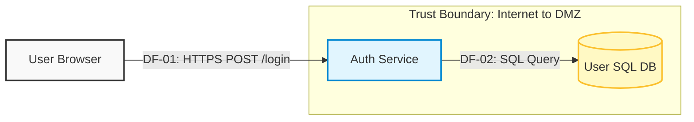

# Threat Modelling Examples

Example diagrams using Mermaid to create the diagrams.


### Test diagram 1


### Test diagram 2

```mermaid

graph TD
    %% Styling Classes
    classDef interactor fill:#f5f5f5,stroke:#666,stroke-width:2px;
    classDef process fill:#e3f2fd,stroke:#0d47a1,stroke-width:2px;
    classDef datastore fill:#fffde7,stroke:#f57f17,stroke-width:2px;
    classDef boundary fill:none,stroke:#d32f2f,stroke-dasharray: 5 5,stroke-width:2px;

    %% Elements Outside Corporate Network
    User(1. Public User / Bot):::interactor

    %% Corporate Network Subgraph (Acts as the Trust Boundary)
    subgraph Corporate_Network [TRUST BOUNDARY: Internet to Corporate Network]
        Auth(2. Auth Service):::process
        DB[(4. User DB / SQL)]:::datastore
        Cache[(5. Session Cache / Redis)]:::datastore
    end
    style Corporate_Network boundary;

    %% Third-Party Services Outside
    Twilio(3. SMS Gateway / Twilio):::interactor

    %% Data Flows
    User -->|DF-01: HTTPS /login <br> Payload: Username, Password| Auth
    Auth -->|DF-02: TCP/IP Encrypted <br> Payload: Credentials Check| DB
    Auth -->|DF-03: HTTPS Outbound <br> Payload: SMS Token Request| Twilio
    Auth -->|DF-04: TCP/IP <br> Payload: Store Temp OTP Code| Cache

    